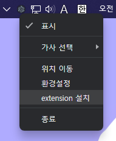

# PandaLyrics

Spotify데스크탑앱에서 노래를 재생하면 alsong서버의 가사를 화면에 그려줍니다.

## 필요

- Spotify의 데스크탑앱
- [Spicetify](https://spicetify.app/)
- [pandaLyrics.js](https://github.com/vbalien/spicetify-extension-pandaLyrics) ([익스텐션 설치](#익스텐션-설치) 참고)

## 스크린샷

## 익스텐션 설치

- ### 프로그램 메뉴에서 설치

- ### 수동으로 설치
  [Spicetify 의 지침](https://spicetify.app/docs/advanced-usage/extensions#installing)을 따라 설치합니다.

## 라이센스

MIT
